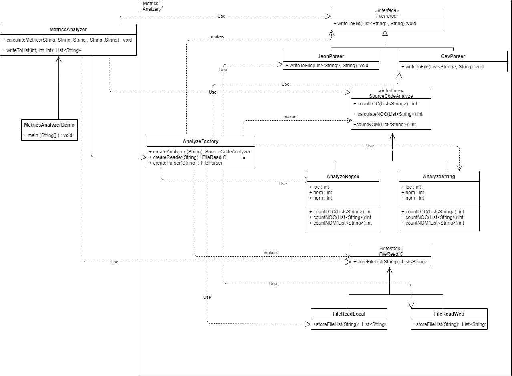

## Analyzermetrics

Our third assignment is about working on the principles of a good way programming a new project
What it does is  types of metrics (lines of code, number of classes, number of methods) with 
two different ways; using regular expressions or string comparison.

## Changes on project
* New interface has been made for each class :
  * FileReadIO: A interface which includes the methods of FileReading 
  * SourceCodeAnalyze : A interface which includes the methods which AnalyzeString and AnalyzeRegex implements
  * FileParser : A interface which includes the methods which CsvParser implements.
* FileReading methods has been devided by two class and we can less dependancy
  * FileReadLocal : which includes the method of recieving a path and returning a list of strings
  * FileReadWeb : which downloads a .java file and return a list of strings
* A new Factory has been made.We have now clearly dependancy on every class.We can now make a new class on each interface without ruining the other class or methods
* readFileIntoString : this methods has been deleted from both of Local and Web class,there is no use of it.
* On AnalyzeRegex and AnalyzeString , the methods now recieve a list of Strings and on each loop it checks its pattern.With this, we remove 
dependancy on the FileRead class,since we only use a list instead.

## Getting started
1. Fork this repository to your account
2. Clone your forked repository to your machine using `git clone https://github.com/YOURUSERNAME/seipassignment` 
3. Browse into the repository `cd seipassignment/analyzermetrics`  
4. Build the executable Java application with: 
	`mvn package jacoco:report`
5.When the buildi is done, go to the target folder 
6.Run the executable by executing:
	 * java –jar “jar-with-dependencies” arg0 arg1 arg2 arg3 arg4
   * were args translate to: 	
	 *  arg0 = “JavaSourceCodeInputFile” (e.g., src/test/resources/TestClass.java)
	 *  arg1 = “sourceCodeAnalyzerType” [regex|strcomp]
	 *  arg2 = “SourceCodeLocationType” [local|web]
	 *  arg3 = “OutputFilePath” (e.g., ../output_metrics_file)
	 *  arg4 = “OutputFileType” [csv|json]
   *  example: 
	 *  java –jar ./target/sourcecodeanalyzer-0.0.1-SNAPSHOT-jar-with-dependencies.jar ./src/test/resources/TestClass.java regex local metrics_results csv
  
  ## UML Class Diagram
  
